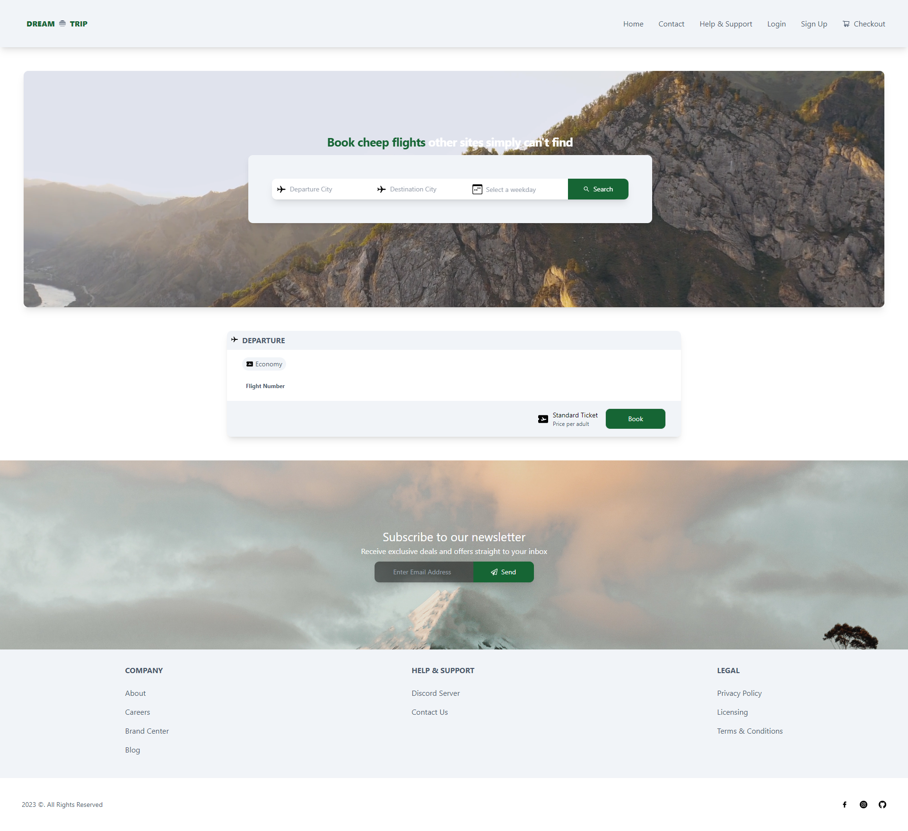
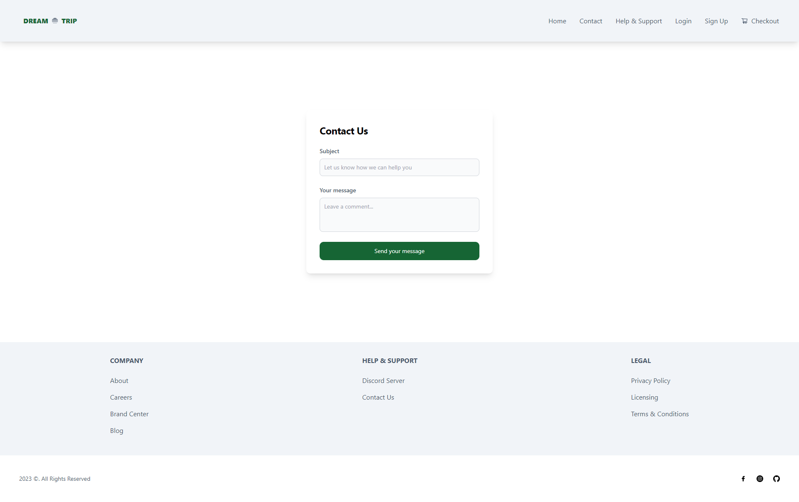
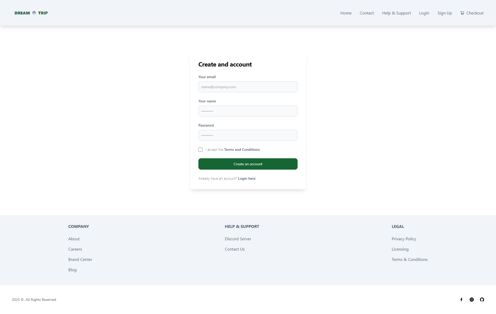

# Dream Trip

Who hasn't suffered when looking for the cheapest and most affordable flight tickets? Perhaps you remember your favorite airline travel website taking too much when loading your request just to tell you No!, your tickets are higher than we informed or there are no available seats at all! 

We are Dream Trip, a new airline travel platform that searches for the most popular flights all over the world from many airlines at the most affordable prices depending on your travel preference: would you travel by your own or in groups?, prefer a direct flight?, travel with extra luggage? etc. 

When you register and become a new member in our community, we provide you with the latest flight updates and be able to contact us to directly respond you to any query you have.

## Link Access
Access to our Dream Trip site through the [following link](Heroku)

## User Story

```
AS A world traveler
I WANT to search for the best offers I can find not only for my desired trips but also for new interesting flight destinations I might go at some point
SO THAT I can travel at the most affordable costs allowing me to save money.
```

## Acceptance Criteria

```
GIVEN an online flight travel platform
WHEN I search for the most affordable flight ticket for my specific destination,
THEN I am presented with the best price offers from different airlines to my specific destination.
WHEN I want to search for a roundtrip for a specific arrival and departure date
THEN I am presented with the best results whose dates are either the exact or close dates for my travel.
WHEN I want to travel to a new place I've never been
THEN I presented with the best flight offers for that place.
WHEN I want to contact the management team for any query or ticket status
THEN I get a reply from the team as soon as possible.
```

## Creation Process & Technology employed

```
Use React for the front end.
Use GraphQL with a Node.js and Express.js server.
Use MongoDB and the Mongoose ODM for the database.
Use queries and mutations for retrieving, adding, updating, and deleting data.
Heroku deployment
Have a polished UI.
Include authentication (using JWT).
Protect sensitive API key information on the server.
```

## Project Screenshots

Dream-Trip main site


Contact Us


Create your Account


- - -
© 2022 IntelSwift llc. brand. Confidential and Proprietary. All Rights Reserved.